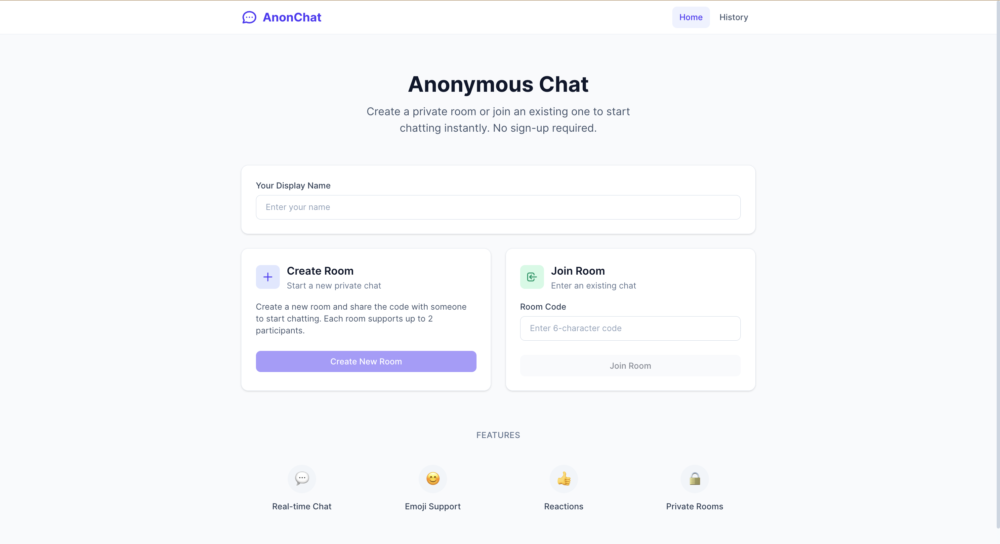
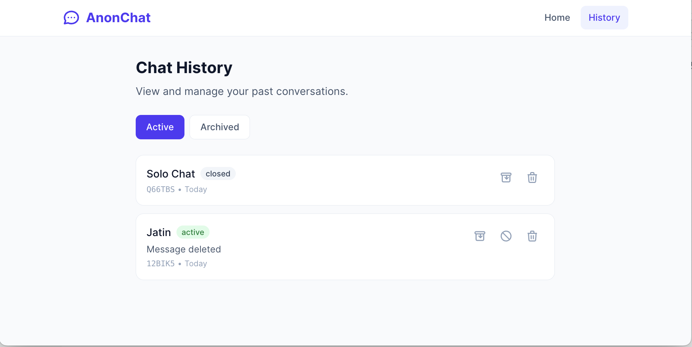
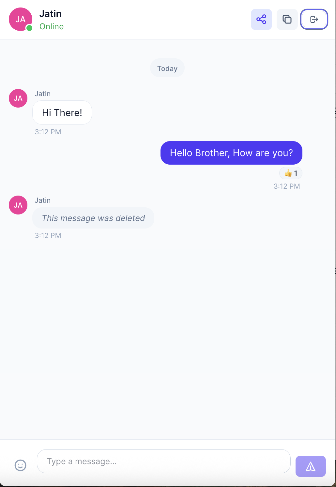

# 💬 Anonymous Chat Application

A production-ready, real-time anonymous chat application enabling private 1:1 conversations via shareable room codes. Built with modern technologies and designed for horizontal scalability.


## 🌐 Live Demo

**Production URL:** [https://srv1191792.hstgr.cloud](https://srv1191792.hstgr.cloud)

---

## 📋 Table of Contents

- [Features](#-features)
- [Tech Stack](#-tech-stack)
- [Architecture](#-architecture)
- [Design Decisions](#-design-decisions)
- [Getting Started](#-getting-started)
- [Production Deployment](#-production-deployment)
- [API Documentation](#-api-documentation)
- [WebSocket Events](#-websocket-events)
- [Security Measures](#-security-measures)
- [Scalability](#-scalability)
- [Project Structure](#-project-structure)
- [Environment Variables](#-environment-variables)

---

## ✨ Features

### Core Features (Per Requirements)
| Feature | Status | Description |
|---------|--------|-------------|
| **🎫 Room Codes** | ✅ | Create/join rooms with 6-character unique codes |
| **💬 Real-time Messaging** | ✅ | Instant message delivery via WebSocket |
| **😀 Emoji Support** | ✅ | Full emoji picker with emoji-only message detection |
| **⌨️ Typing Indicators** | ✅ | See when the other person is typing |
| **👍 Message Reactions** | ✅ | React with like, love, laugh, wow, sad, angry |
| **🗑️ Message Deletion** | ✅ | Soft delete with "Message deleted" placeholder |
| **📜 Chat History** | ✅ | View, archive, and delete past conversations |
| **🚪 Chat Closure** | ✅ | Close chats manually or auto-close when both leave |
| **🔒 Anonymous** | ✅ | No registration required, session-based identity |

### Technical Features
| Feature | Description |
|---------|-------------|
| **🔄 Horizontal Scaling** | Redis adapter enables multi-instance WebSocket support |
| **⚡ Background Jobs** | BullMQ for async message processing and cleanup |
| **🛡️ Rate Limiting** | HTTP & WebSocket throttling (100 req/min) |
| **🔐 Security** | XSS sanitization, Helmet headers, CORS, input validation |
| **📊 Caching** | Redis caching for rooms and sessions (1hr TTL) |
| **📱 Mobile Responsive** | Tap-to-reveal actions on mobile, hover on desktop |
| **🎨 Atomic Design** | Component library (atoms/molecules/organisms) |

---

## 🛠️ Tech Stack

### Backend
| Technology | Version | Purpose |
|------------|---------|---------|
| **NestJS** | 11.x | Modular API framework with dependency injection |
| **MongoDB** | 7.0 | Document database for messages, rooms |
| **Redis** | 7.x | Caching, sessions, Pub/Sub for WebSocket scaling |
| **Socket.IO** | 4.x | Real-time bidirectional communication |
| **BullMQ** | 5.x | Background job processing |
| **Mongoose** | 8.x | MongoDB ODM with schema validation |
| **ioredis** | 5.x | Redis client with cluster support |

### Frontend
| Technology | Version | Purpose |
|------------|---------|---------|
| **Vue 3** | 3.5 | Composition API with `<script setup>` |
| **TypeScript** | 5.x | Type-safe development |
| **Pinia** | 3.x | State management |
| **Tailwind CSS** | 4.x | Utility-first styling |
| **Socket.IO Client** | 4.x | Real-time communication |
| **Vue Router** | 4.x | SPA routing |
| **Vite** | 7.x | Build tool with HMR |

### Infrastructure
| Technology | Purpose |
|------------|---------|
| **Nginx** | Reverse proxy, SSL termination, WebSocket upgrade |
| **Docker** | Containerization |
| **Let's Encrypt** | SSL certificates |

---

## 🏗️ Architecture

### System Overview

```
┌─────────────────────────────────────────────────────────────────────────────┐
│                              FRONTEND (Vue 3 SPA)                           │
│  ┌─────────────┐  ┌─────────────┐  ┌─────────────┐  ┌─────────────────────┐ │
│  │  HomeView   │  │  ChatView   │  │ HistoryView │  │    Pinia Stores     │ │
│  │ Create/Join │  │  Messages   │  │  Past Chats │  │ (Session/Room/Chat) │ │
│  └─────────────┘  └─────────────┘  └─────────────┘  └─────────────────────┘ │
└─────────────────────────────────────────────────────────────────────────────┘
                    │ REST API              │ WebSocket (Socket.IO)
                    ▼                       ▼
┌─────────────────────────────────────────────────────────────────────────────┐
│                           NGINX (Reverse Proxy)                             │
│            /api/* → Backend    /socket.io/* → Backend (WS Upgrade)          │
└─────────────────────────────────────────────────────────────────────────────┘
                                      │
                                      ▼
┌─────────────────────────────────────────────────────────────────────────────┐
│                           BACKEND (NestJS)                                  │
│  ┌──────────────────────────────────────────────────────────────────────┐   │
│  │                         API Gateway Layer                            │   │
│  │  ┌─────────────┐  ┌─────────────┐  ┌─────────────┐  ┌─────────────┐  │   │
│  │  │ RoomCtrl    │  │ MessageCtrl │  │ HistoryCtrl │  │ ChatGateway │  │   │
│  │  │ (REST)      │  │ (REST)      │  │ (REST)      │  │ (WebSocket) │  │   │
│  │  └─────────────┘  └─────────────┘  └─────────────┘  └─────────────┘  │   │
│  └──────────────────────────────────────────────────────────────────────┘   │
│  ┌──────────────────────────────────────────────────────────────────────┐   │
│  │                         Service Layer                                │   │
│  │  ┌─────────────┐  ┌─────────────┐  ┌─────────────┐  ┌─────────────┐  │   │
│  │  │ RoomService │  │ MsgService  │  │ SessionSvc  │  │ HistorySvc  │  │   │
│  │  │ (Business)  │  │ (Business)  │  │ (Identity)  │  │ (Archive)   │  │   │
│  │  └─────────────┘  └─────────────┘  └─────────────┘  └─────────────┘  │   │
│  └──────────────────────────────────────────────────────────────────────┘   │
│  ┌──────────────────────────────────────────────────────────────────────┐   │
│  │                       Repository Layer                               │   │
│  │  ┌────────────────────────────────┐  ┌──────────────────────────────┐│   │
│  │  │       RoomRepository           │  │      MessageRepository       ││   │
│  │  │       (Data Access)            │  │      (Data Access)           ││   │
│  │  └────────────────────────────────┘  └──────────────────────────────┘│   │
│  └──────────────────────────────────────────────────────────────────────┘   │
└─────────────────────────────────────────────────────────────────────────────┘
          │                    │                    │
          ▼                    ▼                    ▼
┌─────────────────┐  ┌─────────────────┐  ┌─────────────────────────────────┐
│    MongoDB      │  │     Redis       │  │           BullMQ                │
│  - Rooms        │  │  - Sessions     │  │  - Message Processing           │
│  - Messages     │  │  - Room Cache   │  │  - Cleanup Jobs                 │
│  - Participants │  │  - Pub/Sub      │  │  - Async Operations             │
└─────────────────┘  └─────────────────┘  └─────────────────────────────────┘
```

### Horizontal Scaling Architecture

```
                        ┌─────────────────────────────┐
                        │      LOAD BALANCER          │
                        │   (Nginx / Cloud LB)        │
                        └─────────────────────────────┘
                                      │
          ┌───────────────────────────┼───────────────────────────┐
          ▼                           ▼                           ▼
┌─────────────────┐         ┌─────────────────┐         ┌─────────────────┐
│   NestJS API    │         │   NestJS API    │         │   NestJS API    │
│   Instance 1    │         │   Instance 2    │         │   Instance N    │
│   + Socket.IO   │         │   + Socket.IO   │         │   + Socket.IO   │
└─────────────────┘         └─────────────────┘         └─────────────────┘
          │                           │                           │
          └───────────────────────────┼───────────────────────────┘
                                      │
     ┌────────────────────────────────┼────────────────────────────────┐
     │                                │                                │
     ▼                                ▼                                ▼
┌──────────────┐              ┌──────────────┐               ┌──────────────┐
│    Redis     │◄────────────►│   MongoDB    │◄─────────────►│   BullMQ     │
│   (Pub/Sub)  │              │   (Primary)  │               │   Workers    │
└──────────────┘              └──────────────┘               └──────────────┘
        │
        │ @socket.io/redis-adapter
        │ Cross-instance event broadcasting
        ▼
┌─────────────────────────────────────────────────────────────────────────────┐
│  User A on Instance 1 sends message → Redis Pub/Sub → User B on Instance 2  │
└─────────────────────────────────────────────────────────────────────────────┘
```

---

## 💡 Design Decisions

### 1. UUID v7 for Identifiers
**Decision:** Use UUID v7 instead of MongoDB ObjectId or auto-increment IDs.

**Rationale:**
- Time-sortable (embeds timestamp) - enables efficient cursor-based pagination
- Globally unique - safe for distributed systems without coordination
- No information leakage (unlike sequential IDs)
- Compatible with MongoDB's `_id` field as string

### 2. Session-Based Identity (No Auth)
**Decision:** Use client-generated session IDs stored in localStorage.

**Rationale:**
- Meets "anonymous" requirement - no registration needed
- Simplifies UX - users can chat immediately
- Session persists across page refreshes
- Trade-off: No cross-device identity (acceptable for anonymous chat)

### 3. Soft Delete for Messages
**Decision:** Mark messages as deleted rather than removing from database.

**Rationale:**
- Preserves chat timeline and context
- Shows "Message deleted by X" placeholder
- Enables potential audit logging
- Maintains reaction/position integrity

### 4. Redis for Multiple Concerns
**Decision:** Single Redis instance for caching, sessions, Pub/Sub, and rate limiting.

**Rationale:**
- Reduces infrastructure complexity
- Redis handles all use cases efficiently
- Easy to scale to Redis Cluster if needed
- BullMQ integrates natively with Redis

### 5. Repository Pattern for Data Access
**Decision:** Abstract MongoDB operations behind repository classes.

**Rationale:**
- Testability - easy to mock for unit tests
- Single responsibility - repositories only handle data access
- Flexibility - can swap data stores without changing services
- Consistent query patterns across the application

### 6. WebSocket Default Namespace
**Decision:** Use Socket.IO's default namespace instead of custom `/chat` namespace.

**Rationale:**
- Simpler nginx proxy configuration
- Avoids namespace routing issues with Redis adapter
- Better compatibility across deployment environments

---

## 🚀 Getting Started

### Prerequisites
- Node.js 20.x or 22.x
- pnpm 8.x+ (recommended) or npm
- Docker & Docker Compose

### Quick Start with Docker (Production Mode)

```bash
# Clone the repository
git clone https://github.com/jatinsuneja/GoHighLevel-Assignment.git
cd GoHighLevel-Assignment

# Copy and configure environment variables
cp env.example .env
# Edit .env and set MONGO_PASSWORD (required)

# Build and start all services
docker-compose up -d --build

# View logs
docker-compose logs -f

# Stop all services
docker-compose down

# Stop and remove volumes (clean slate)
docker-compose down -v
```

Access at: **http://localhost:3000**

### Docker Development Mode (with Hot Reload)

```bash
# Start with development configuration
docker-compose -f docker-compose.dev.yml up -d --build

# View logs
docker-compose -f docker-compose.dev.yml logs -f

# Stop
docker-compose -f docker-compose.dev.yml down
```

- Frontend (Vite HMR): **http://localhost:5173**
- Backend API: **http://localhost:3000/api/v1**

### Local Development (Without Docker for App)

#### 1. Start Infrastructure Only
```bash
# Start MongoDB and Redis containers
docker-compose up -d mongodb redis
```

#### 2. Backend Setup
```bash
cd backend
pnpm install

# Start development server (watches for changes)
pnpm start:dev
```
Backend: **http://localhost:3000/api/v1**

#### 3. Frontend Setup
```bash
cd frontend
pnpm install

# Start development server with HMR
pnpm dev
```
Frontend: **http://localhost:5173**

---

## 🌍 Production Deployment

### Server Requirements
- Ubuntu 20.04+ or similar Linux
- 2GB+ RAM
- Node.js 20.x
- MongoDB 7.x
- Redis 7.x
- Nginx
- SSL certificate (Let's Encrypt)

### Deployment Steps

#### 1. Clone and Build
```bash
# Clone repository
cd /var/www/myapp
git clone https://github.com/jatin-suneja/GoHighLevel-Assignment.git code
cd code

# Build backend
cd backend
pnpm install
pnpm build

# Build frontend
cd ../frontend
pnpm install
pnpm build
```

#### 2. Configure Backend Environment
```bash
# backend/.env
NODE_ENV=production
PORT=3000
MONGODB_URI=mongodb://localhost:27017/anonymous_chat
REDIS_HOST=localhost
REDIS_PORT=6379
CORS_ORIGINS=https://yourdomain.com
```

#### 3. Configure Nginx
```nginx
server {
    listen 443 ssl;
    server_name yourdomain.com;
    
    ssl_certificate /etc/letsencrypt/live/yourdomain.com/fullchain.pem;
    ssl_certificate_key /etc/letsencrypt/live/yourdomain.com/privkey.pem;

    # Frontend static files
    root /var/www/anon-chat/frontend/dist;
    index index.html;

    location / {
        try_files $uri $uri/ /index.html;
    }

    # API proxy - maps /api/* to backend's /api/v1/*
    location /api/ {
        proxy_pass http://localhost:3000/api/v1/;
        proxy_http_version 1.1;
        proxy_set_header Host $host;
        proxy_set_header X-Real-IP $remote_addr;
        proxy_set_header X-Forwarded-For $proxy_add_x_forwarded_for;
        proxy_set_header X-Forwarded-Proto $scheme;
    }

    # WebSocket proxy (CRITICAL for real-time features)
    location /socket.io/ {
        proxy_pass http://localhost:3000/socket.io/;
        proxy_http_version 1.1;
        proxy_set_header Upgrade $http_upgrade;
        proxy_set_header Connection "upgrade";
        proxy_set_header Host $host;
        proxy_set_header X-Real-IP $remote_addr;
        proxy_set_header X-Forwarded-For $proxy_add_x_forwarded_for;
        proxy_set_header X-Forwarded-Proto $scheme;
        proxy_read_timeout 86400s;
    }
}
```

#### 4. Start Backend with PM2
```bash
# Install PM2 globally
npm install -g pm2

# Start backend
cd /var/www/myapp/code/backend
pm2 start dist/main.js --name "chat-backend"
pm2 save
pm2 startup
```

#### 5. Reload Nginx
```bash
sudo nginx -t
sudo systemctl reload nginx
```

---

## 📡 API Documentation

### Base URL
```
Production: https://yourdomain.com/api/v1
Development: http://localhost:3000/api/v1
```

### Authentication
All endpoints require `X-Session-Id` header (UUID stored in client localStorage).

### Room Endpoints

#### Create Room
```http
POST /rooms/create
Content-Type: application/json
X-Session-Id: <session-id>

{
  "displayName": "Anonymous User",
  "maxParticipants": 2,      // Optional, default: 10
  "expiresInHours": 24       // Optional, default: 24
}
```

**Response (201)**
```json
{
  "success": true,
  "data": {
    "roomId": "019b4f09-336d-7853-b831-0328676f35c2",
    "roomCode": "ABC123",
    "participants": [
      {
        "userId": "019b4a69-be00-7c07-b637-a9a39a40593c",
        "displayName": "Anonymous User",
        "isActive": true,
        "joinedAt": "2025-12-24T10:00:00.000Z"
      }
    ],
    "status": "active",
    "createdAt": "2025-12-24T10:00:00.000Z"
  }
}
```

#### Join Room
```http
POST /rooms/join
Content-Type: application/json
X-Session-Id: <session-id>

{
  "roomCode": "ABC123",
  "displayName": "Anonymous User 2"
}
```

#### Get Room by ID
```http
GET /rooms/:roomId
X-Session-Id: <session-id>
```

#### Get Room by Code
```http
GET /rooms/code/:roomCode
X-Session-Id: <session-id>
```

#### Leave Room
```http
POST /rooms/:roomId/leave
X-Session-Id: <session-id>
```

#### Close Room
```http
POST /rooms/:roomId/close
X-Session-Id: <session-id>
```

### Message Endpoints

#### Send Message
```http
POST /messages
Content-Type: application/json
X-Session-Id: <session-id>

{
  "roomId": "019b4f09-336d-7853-b831-0328676f35c2",
  "content": "Hello! 👋",
  "contentType": "text"  // "text" or "emoji"
}
```

#### Get Messages (Cursor Pagination)
```http
GET /messages?roomId=<roomId>&limit=50&before=<messageId>
X-Session-Id: <session-id>
```

**Response (200)**
```json
{
  "success": true,
  "data": {
    "messages": [
      {
        "messageId": "019b4f09-786d-7467-91df-997551cf6e1b",
        "roomId": "019b4f09-336d-7853-b831-0328676f35c2",
        "senderId": "019b4a69-be00-7c07-b637-a9a39a40593c",
        "senderName": "Anonymous User",
        "content": "Hello! 👋",
        "contentType": "text",
        "isDeleted": false,
        "reactions": [
          { "type": "like", "count": 1, "userReacted": true }
        ],
        "createdAt": "2025-12-24T10:00:00.000Z"
      }
    ],
    "hasMore": true,
    "nextCursor": "019b4f09-786d-7467-91df-997551cf6e1a"
  }
}
```

#### Delete Message
```http
DELETE /messages/:messageId
X-Session-Id: <session-id>
```

#### Add Reaction
```http
POST /messages/:messageId/reactions
Content-Type: application/json
X-Session-Id: <session-id>

{
  "type": "like"  // like, love, laugh, wow, sad, angry
}
```

#### Remove Reaction
```http
DELETE /messages/:messageId/reactions/:type
X-Session-Id: <session-id>
```

### History Endpoints

#### Get Chat History
```http
GET /history?includeArchived=false
X-Session-Id: <session-id>
```

#### Archive Chat
```http
POST /history/:roomId/archive
X-Session-Id: <session-id>
```

#### Unarchive Chat
```http
POST /history/:roomId/unarchive
X-Session-Id: <session-id>
```

#### Delete from History
```http
DELETE /history/:roomId
X-Session-Id: <session-id>
```

---

## 🔌 WebSocket Events

### Connection
```javascript
import { io } from 'socket.io-client'

// Production: connects to same origin with WSS
const socket = io({
  path: '/socket.io',
  transports: ['websocket', 'polling'],
  auth: { sessionId: 'your-session-id' }
})
```

### Client → Server Events

| Event | Payload | Description |
|-------|---------|-------------|
| `join_room` | `{ roomId: string }` | Join a chat room |
| `leave_room` | `{ roomId: string }` | Leave a chat room |
| `send_message` | `{ roomId, content, contentType }` | Send a message |
| `typing` | `{ roomId, isTyping: boolean }` | Typing indicator |
| `add_reaction` | `{ messageId, reactionType }` | Add reaction |
| `remove_reaction` | `{ messageId, reactionType }` | Remove reaction |
| `delete_message` | `{ messageId }` | Delete a message |

### Server → Client Events

| Event | Payload | Description |
|-------|---------|-------------|
| `room_joined` | `{ roomId, userId, roomCode, participants, recentMessages }` | Successfully joined |
| `user_joined` | `{ userId, displayName, timestamp }` | Another user joined |
| `user_left` | `{ userId, displayName, timestamp }` | User left room |
| `participants_updated` | `{ roomId, participants }` | Participant list changed |
| `new_message` | `Message object` | New message received |
| `message_deleted` | `{ messageId, deletedBy, placeholder }` | Message was deleted |
| `reaction_updated` | `{ messageId, reactions }` | Reactions changed |
| `user_typing` | `{ userId, displayName, isTyping }` | Typing status |
| `room_closed` | `{ roomId, reason }` | Room was closed |
| `error` | `{ message }` | Error occurred |

---

## 🔐 Security Measures

| Measure | Implementation |
|---------|----------------|
| **XSS Prevention** | `xss` library sanitizes all user input |
| **Security Headers** | Helmet.js adds CSP, X-Frame-Options, etc. |
| **Rate Limiting** | 100 requests/minute per session (HTTP & WebSocket) |
| **Input Validation** | class-validator DTOs with whitelist mode |
| **CORS** | Restricted to allowed origins in production |
| **No Auth Tokens** | Session-based, no JWT to steal |
| **Soft Delete** | Messages not truly deleted, prevents data loss |

---

## 📈 Scalability

### Current Capacity
- **Concurrent connections:** 10,000+ per instance (Node.js event loop)
- **Messages/second:** 1,000+ (depends on MongoDB write capacity)
- **Horizontal scaling:** Add instances behind load balancer

### Scaling Strategy
1. **Stateless backend** - Any instance can handle any request
2. **Redis Pub/Sub** - WebSocket events broadcast across instances
3. **MongoDB indexes** - Optimized for query patterns
4. **Connection pooling** - Efficient database connections
5. **Caching** - Redis reduces database load

### Future Enhancements (If Needed)
- MongoDB sharding for 100M+ messages
- Redis Cluster for HA
- Kubernetes for auto-scaling
- CDN for static assets

---

## 📁 Project Structure

```
.
├── backend/
│   ├── src/
│   │   ├── common/                 # Shared utilities
│   │   │   ├── decorators/         # @Session custom decorator
│   │   │   ├── exceptions/         # Domain-specific exceptions
│   │   │   ├── filters/            # Global exception filter
│   │   │   ├── guards/             # Throttler guards
│   │   │   ├── interceptors/       # Logging & response transform
│   │   │   ├── pipes/              # XSS sanitization pipe
│   │   │   └── utils/              # UUID generator
│   │   ├── config/
│   │   │   ├── redis.module.ts     # Redis client providers
│   │   │   └── redis-io.adapter.ts # Socket.IO Redis adapter
│   │   ├── gateways/
│   │   │   └── chat.gateway.ts     # WebSocket event handlers
│   │   ├── modules/
│   │   │   ├── history/            # Chat history management
│   │   │   ├── message/            # Message CRUD & reactions
│   │   │   ├── room/               # Room lifecycle
│   │   │   └── session/            # Anonymous session handling
│   │   ├── queues/                 # BullMQ job processors
│   │   ├── app.module.ts           # Root module
│   │   └── main.ts                 # Bootstrap with adapters
│   ├── Dockerfile                  # Production multi-stage build
│   ├── Dockerfile.dev              # Development with hot reload
│   ├── .dockerignore               # Docker build exclusions
│   └── package.json
│
├── frontend/
│   ├── src/
│   │   ├── assets/styles/          # Global CSS
│   │   ├── components/
│   │   │   ├── atoms/              # Button, Input, Badge, Avatar, Spinner
│   │   │   ├── molecules/          # Modal, MessageBubble, Toast, EmojiPicker
│   │   │   └── organisms/          # ChatHeader, MessageList, MessageInput
│   │   ├── layouts/                # DefaultLayout wrapper
│   │   ├── router/                 # Vue Router config
│   │   ├── services/
│   │   │   ├── api/                # Axios REST clients
│   │   │   └── socket/             # Socket.IO client wrapper
│   │   ├── stores/                 # Pinia state management
│   │   │   ├── session.store.ts    # User identity
│   │   │   ├── room.store.ts       # Current room state
│   │   │   ├── chat.store.ts       # Messages & typing
│   │   │   ├── history.store.ts    # Past chats
│   │   │   └── notification.store.ts # Toast notifications
│   │   ├── types/                  # TypeScript interfaces
│   │   ├── utils/                  # Formatters, constants, storage
│   │   ├── views/                  # Page components
│   │   ├── App.vue
│   │   └── main.ts
│   ├── nginx.conf                  # Nginx config (API & WebSocket proxy)
│   ├── Dockerfile                  # Production with Nginx
│   ├── Dockerfile.dev              # Development with Vite HMR
│   ├── .dockerignore               # Docker build exclusions
│   └── package.json
│
├── docker-compose.yml              # Production deployment
├── docker-compose.dev.yml          # Development with hot reload
├── env.example                     # Environment variables template
├── mongo-init.js                   # MongoDB initialization script
└── README.md
```

---

## ⚙️ Environment Variables

### Docker Compose (.env)
```bash
# Required for docker-compose
MONGO_USERNAME=admin
MONGO_PASSWORD=your_secure_password_here  # Required!
MONGO_DATABASE=anonymous_chat

# Optional
REDIS_PASSWORD=
CORS_ORIGINS=http://localhost:3000,http://frontend:3000
```

### Backend (.env)
```bash
# Server
NODE_ENV=production
PORT=3000
API_PREFIX=api/v1

# Database
MONGODB_URI=mongodb://localhost:27017/anonymous_chat

# Redis
REDIS_HOST=localhost
REDIS_PORT=6379
REDIS_PASSWORD=           # Optional

# Security
CORS_ORIGINS=https://yourdomain.com

# Rate Limiting
THROTTLE_TTL=60000        # 1 minute window
THROTTLE_LIMIT=100        # Max requests per window

# Cache TTL (seconds)
CACHE_TTL_ROOM=3600       # 1 hour
CACHE_TTL_SESSION=86400   # 24 hours
```

### Frontend (.env)
```bash
# Only needed for development or non-proxied setups
VITE_SERVER_BASE_URL=http://localhost:3000
VITE_API_URL=/api
```

---

## 📸 Screenshots

### Home Page - Create/Join Room


### Chat Interface


### Chat History


### Mobile View


---

## 👨‍💻 Author

**Jatin Suneja**

---

## 📄 License

This project is created as part of a technical assessment for GoHighLevel.
